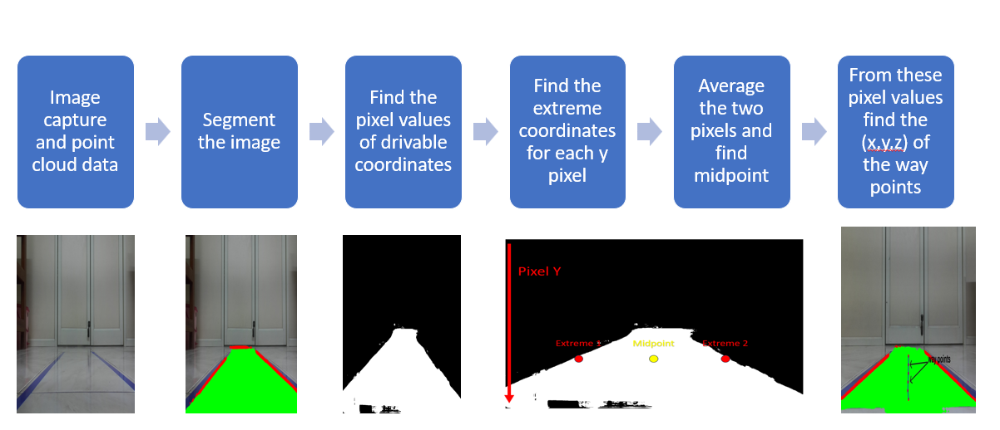
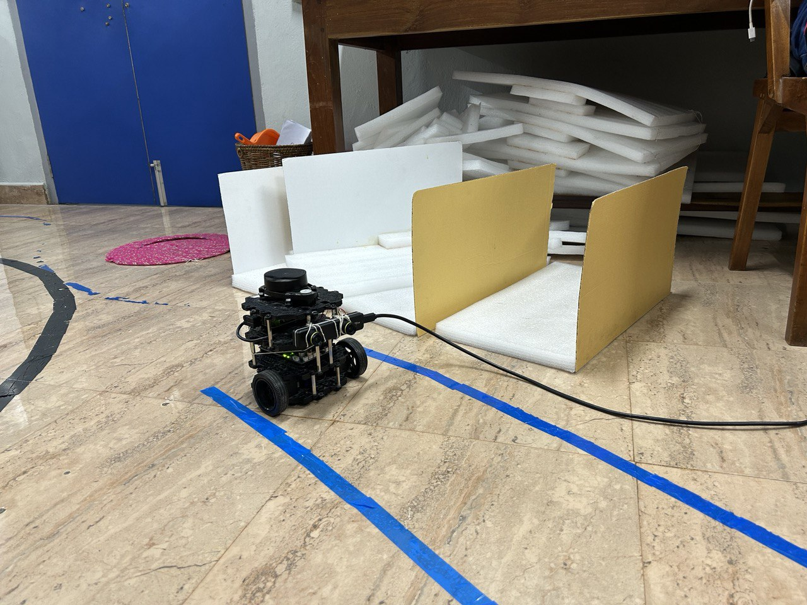

# Software module for autnomous cars

## Author

- [Rahil Shah](https://github.com/rahilshah17)

## Guide
- **Dr. Ramkrishna Pasumarthy**

## Introduction

This GitHub repository showcases the work conducted as part of the undergraduate research credits program, under the guidance of Dr. Ramkrishna Pasumarthy. Our research team, comprising five dedicated researchers, collaborated to implement an autonomous car system. My specific focus within the project was on developing the segmentation module.

In this repository, we document the results of our work and provide guidance for future researchers working in the same domain. Our aim was to develop a software module for the autonomous car, which this repository encapsulates.

### Overview
The image below summarizes the workflow of our software module:




The flow of the project as described as below:
- Capture image from zed. 
- Segment the image.
- Identify the pixel values of drivable coordinates.
- Determine the waypoints' pixels using the two-pointer algorithm.  
- Estimate the 3D coordinates of these waypoints.
-Send these 3D coordinates to the control module.
- Repeat the process from the first step.

## Demo

You can view a demonstration of the project below. For a full video of the experiment, please visit our [YouTube link](https://www.youtube.com/watch?v=swUS9c_RZiA).


## Setup

Setup of the car involves the zed camera is kept at the height of 5.5 cm from the ground, and connecting the camera to the server computer. The below image illustrates the setup of the work

<!--  -->


## Prerequisites

First of all clone the repo in your local computer
```shell
git clone https://github.com/rahilshah17/software_car
```

### Installing the requirements

#### Zed
- Installing the zed sdk according to the os you are working linux/windows/mac. The link to the installation: https://www.stereolabs.com/developers/release

- After this one needs to run the installer and install the zed sdk in the environment one is working one
- Run the python api for zed following the instructions given in the following link: https://github.com/stereolabs/zed-python-api

#### Other python libraries

- Change your directory to software_car/YOLOP and run the following commands

```shell
conda install pytorch==1.7.0 torchvision==0.8.0 cudatoolkit=10.2 -c pytorch
```

```shell
pip install -r requirements.txt
```

if you are not using conda environment then also one may install the above libraries in global environment. 

Run the following command and see if everything executes without any error

```shell
python tools/demo.py --source inference/images
```

If you find some library installation missing then install/update the libraries. With these we are ready with all the prerequisites.
## Code

The main functionality of our autonomous car system is encapsulated in the **main.py** file. This file serves as the central control hub, orchestrating the execution of various modules and processes required for autonomous navigation.

### Path configuration
Before running the main.py file, it's essential to ensure that all necessary path configurations are appropriately set. Comments within the file guide you to make any required adjustments to file paths for smooth execution.

### Running the code
To execute the autonomous navigation system, simply run the following command:

```shell
python main.py
```
This command initiates the image capture process and subsequent data processing. After processing, the system generates waypoints representing the planned path for the car. These waypoints are then stored in the global_waypoints.csv file for reference.

### Understanding the code
Comments are strategically placed throughout the main.py file to enhance comprehension of the code's functionality. These comments provide insights into the purpose and execution flow of different sections within the file. We encourage you to refer to these comments for a deeper understanding of how the code operates.

By following the instructions and comments within the main.py file, you can gain a comprehensive understanding of how each component contributes to the overall functioning of the autonomous car system.
## Integration Guide for Control Engineers

The integration process involves incorporating the navigation algorithm, which continuously updates waypoints for the autonomous car to follow. Here's a breakdown of the process with line numbers referencing the main.py file and utilizing the way_points array:

    1. Capture Image and Process Data (Lines 94-208):
        - From line 94 to 208 in main.py, the program captures an image from the ZED camera and processes it to generate waypoints.
        - The waypoints are calculated and stored in the way_points array, which contains coordinates relative to the current position of the car.
    2. Updating Current Position using IMU Sensors:
        - At the beginning of every iteration, update the curr_x and curr_y variables using data from the IMU sensors of the car.
        - These variables represent the current position of the car relative to the initial position.

    3. Integration with Control Module:
        - Once the way_points array is populated with the waypoints, it is ready to be integrated with the control module of the car.

    4. Transmission of Waypoints to Control Module:
        - At this stage, the way_points array containing the waypoints is transmitted to the control module for the autonomous car.
    5. Driving Along Waypoints:
        - The control module interprets the received way_points array and implements control logic to drive the car along these waypoints.
        - The control module adjusts the car's steering and throttle based on the waypoints to navigate smoothly along the planned path.
    6. Completion of Waypoints and Looping:
        - The car continues to follow the waypoints until it reaches the last waypoint in the way_points array.
        - Once the last waypoint is reached, the process repeats, starting again from capturing a new image and updating the way_points array.


## Detailed Report

For an in-depth understanding of the algorithms developed for this project and their verification process, please refer to the following resources:

- [Detailed Report](https://github.com/rahilshah17/rahilshah17/software_car/project_report.pdf) 
- [Presentation](https://github.com/rahilshah17/rahilshah17/software_car/presentation.pptx)


## Acknowledgements

I would like to extend my gratitude to all the contributors to this project. Special thanks to:

- **Dr. Ramkrishna Pasumarthy** for his invaluable guidance throughout the project.
- **Soumyajit Sir** for his assistance with the development of deep learning algorithms.
- **Subhadhip Sir** for his insights and understanding of the device and overall hardware.
- **Vasumathi Ma'am** for her expertise in conducting experiments.

Your support and expertise were crucial to the success of this project.

## References

We utilized several references to develop the software module for the autonomous car. We acknowledge and thank the authors of these resources for making their algorithms open source, thereby contributing to the advancement of autonomous driving research. The references are as follows:

- **YOLOP**: The architecture and model were adopted from the following repository and research: [YOLOP](https://github.com/hustvl/YOLOP).
- **Pixel to 3D Coordinates Conversion**: The method for converting pixels to 3D coordinates was referenced from this guide: [Link](https://thomasfermi.github.io/Algorithms-for-Automated-Driving/LaneDetection/InversePerspectiveMapping.html).

I do not claim credit for the development for the above two algorithms and I sincerely thank the original authors for their contributions.
